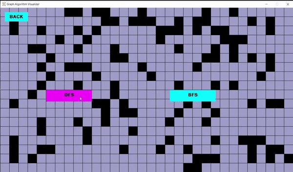

 

# VisuAlgo : A path-finding visualization tool 

A tool for visualizing the working of famous path finding algorithms like BFS(breadth first search) and DFS(depth first search) , with the following functionalities
* User can choose start and end point
* User can build walls 

## Requirements
* [Python3](https://www.python.org/)
* [Pip](https://pypi.org/project/pip/)
* [PyGame](https://www.pygame.org/wiki/about)
* [Tkinter](https://docs.python.org/3/library/tkinter.html)
* [Sys](https://docs.python.org/3/library/sys.html)
* [OS](https://docs.python.org/3/library/os.html)

## Run in Local Machine
Download or clone the repository. Then run the following command in the downloaded directory.
> python VisuAlgo.py

Note: For running VisuAlgo, all the necessary libraries must be installed or else , click [here](https://docs.python.org/3/library/os.html) for `.exe` file

## Instructions 
* Users can either draw `Custom maze` or select `Random Maze`

* Then users can select from `BFS` or `DFS`

* DFS

  

* BFS

  
  
## Controls
* Restart : `r`
* Start process : `enter`
* Draw and erase walls : `cursor`
* Pause : `space-bar`

## Algorithm
 ### DFS (Depth first search) : 
  The Depth First Search (DFS) is the most fundamental search algorithm used to explore nodes and edges of a    graph. It runs with a       time complexity of O(V+E) and is often used as a building block in other algorithms.
  By itself the DFS isn’t all that useful, but when augmented to perform other tasks such as count connected components, determine         connectivity, or find bridges/articulation points then DFS really shines.
   
   
   
 ### BFS (Breadth first search) : 
  The Breadth First Search (BFS) is another fundamental search algorithm used to explore nodes and edges of   a graph. It runs with a       time complexity of O(V+E) and is often used as a building block in other algorithms.
  The BFS algorithm is particularly useful for one thing: finding the shortest path on unweighted graphs.
  
  
  
  ### Contributing
   We welcome all kinds of contributions from the open-source community.
